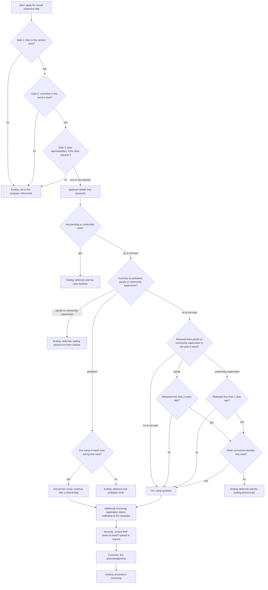

# Reference intake flow

This is the structure of a record clearance intake form, drawn from The Access Project's Mono County Public Defender intake (form logic checked 2026-09-24) with program-specific wording removed. A clinic can rebuild it in Typeform, Airtable forms, Google Forms or paper. Every decision node maps to a field in `intake-schema.md`.

## Decision nodes and record fields

| Node | Question | Record field | Note |
|---|---|---|---|
| B, C, D | Program gates | `program_gates.*` | Clinic-configurable; the plugin records, the profile judges |
| F | Pending or undecided case | `status.pending_case` | "Not sure" continues with a review flag rather than ending |
| G | Current supervision | `status.current_supervision` | "Community supervision" is recorded as `mandatory_supervision` pending confirmation |
| H, M | Fire camp | `status.fire_camp`, `status.fire_camp_year` | PC 1203.4b relief is not screened in v1; the flag routes to referral |
| J | Supervision ended in the past 3 years | `status.supervision_ended_within_3_years` | |
| K, L | How long ago | `status.supervision_ended_bucket` | Month count added by staff when known |
| N | Other convictions | `status.other_convictions` | Keeps applicants with older eligible cases in the program |
| O | Registration; trafficking or DV | `status.registration_290`, `status.trafficking_or_dv_remedies` | |
| P | RAP sheet | `status.has_rap_sheet` | The document itself is never imported |
| Q | Consents | `consents.*` | Wording is the clinic's own |

## Endings

The reference form uses three kinds of endings: not in this program (with a referral), deferred with the reason and when to reapply, and proceed. The deferral endings are the form's own pre-screen; `triage-rules.md` repeats the same checks at import so that a record arriving from a different form, a CSV or a paper intake gets the same treatment.

## Optional per-case questions

To get per-case bands from the form alone, add one repeating block per conviction with six questions: which court (county), what year, the offense type (infraction, misdemeanor, felony), the sentence type (probation only, jail, split sentence with supervision, prison, fine only), whether probation was granted and how it ended (completed, ended early, revoked, still on it), the sentence term, and the sentencing month. Map the block to a `cases[]` entry. Without it, `cases` stays empty and the screen runs at client level.

## What the form does not collect

Per-case facts (county, year, offense type, sentence type and term, probation outcome, sentencing month). The reference program reads those from the RAP sheet later. `/record-clearance-legal:intake-import` asks for them when staff have them and leaves `cases` empty when they do not; `/record-clearance-legal:eligibility-screen` runs a client-level screen either way.
